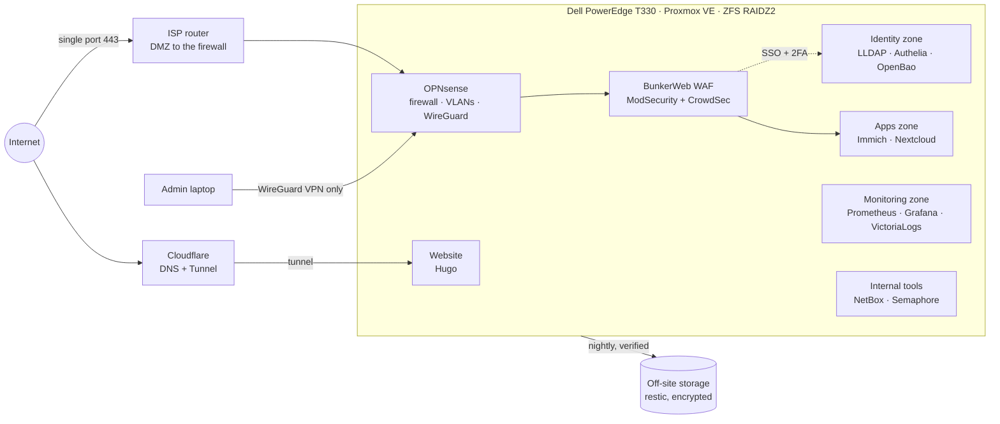

# Homelab

[](https://github.com/maximebertrand-dev/Homelab/actions/workflows/ci.yml)
[](https://maximebertrand.net/en/)
[](LICENSE)

A single-server homelab run like a small production platform: everything is described as code, every structural
choice is written down as an ADR, and the services are used every day by my family (photos, files). Real
incidents are written up as post-mortems.

The documentation is written in French, with a full English translation in [`docs/en/`](docs/en/). Both are
published at **[maximebertrand.net](https://maximebertrand.net/en/)** (FR / EN switch in the header).
This README is the English entry point.

## Architecture



- **One inbound port.** Public services go through the firewall, a WAF (OWASP CRS, CrowdSec, geo-filtering, rate
  limiting) and single sign-on with two-factor authentication. Administration is reachable only over the VPN.
- **Zones that deny by default.** Each zone is its own VLAN, with one VM per zone; every allowed flow is listed and
  justified in a flow matrix.
- **Everything as code.** No VM, firewall rule or DNS record is created by hand. A second Ansible run must report
  `changed=0`.

## Stack

| Layer | Tools |
|---|---|
| Hardware | Dell PowerEdge T330 (Xeon E3, 32 GB ECC, 4 × 3 TB SAS) |
| Hypervisor & storage | Proxmox VE, ZFS RAIDZ2, sanoid snapshots |
| Network & security | OPNsense, VLANs, WireGuard, BunkerWeb (ModSecurity + OWASP CRS), CrowdSec, Cloudflare DNS and Tunnel |
| Identity | LLDAP, Authelia (OpenID Connect, TOTP, WebAuthn), invitations by one-time link (no password is ever sent) |
| Infrastructure as Code | OpenTofu (Proxmox, OPNsense, Cloudflare, OpenBao), Ansible, Semaphore UI |
| Secrets | SOPS + age in Git, OpenBao (OIDC for humans, AppRole for automation) |
| Observability | Prometheus, Alertmanager, Grafana, VictoriaLogs, a custom status page, ntfy push alerts, UptimeRobot as an outside probe |
| Backup | restic to off-site storage every night, with end-to-end SHA-256 verification of what was uploaded |
| Applications | Docker Compose in one VM per zone: Immich (photos), Nextcloud (files), NetBox (source of truth) |

## Decisions worth reading

The [23 ADRs](docs/en/adr/) record the context, the options considered, the decision and its consequences. A few that
show the trade-offs best:

- [ADR 0008](docs/en/adr/0008-exposition-directe-waf.md): exposing services directly behind a WAF rather than
  through Cloudflare, and what that costs (no IP allow-listing, home IP visible in DNS).
- [ADR 0010](docs/en/adr/0010-serveur-unique.md): one server with a virtualised firewall instead of a cluster and a
  dedicated firewall box, and what that single point of failure implies (out-of-band access, off-site backups).
- [ADR 0019](docs/en/adr/0019-sauvegardes-hors-site.md): what is backed up off-site, what is deliberately not, and how
  backups are verified.
- [ADR 0022](docs/en/adr/0022-certificats-internes.md): an internal certificate authority with an offline root, and
  why the intermediate lives on the firewall rather than in the secrets vault.

## Operations

- **Runbooks** used in practice: [responding to an alert](docs/en/runbooks/reagir-alerte.md),
  [verifying and restoring backups](docs/en/runbooks/sauvegardes.md) (with an honest list of what has and has not been
  tested yet).
- **Post-mortems** of real incidents: a WAF running out of memory on large uploads and a CrowdSec outage
  ([30/09](docs/en/postmortems/2026-09-30-coupures-du-waf.md)), a security test that banned my own household
  ([29/09](docs/en/postmortems/2026-09-29-maison-bannie-par-le-waf.md)), a backup cut by the hosting provider's
  maintenance ([01/10](docs/en/postmortems/2026-10-01-sauvegarde-maintenance-hebergeur.md)).
- **Journal**: the [build log](docs/en/journal/), step by step.

## Repository layout

```text
docs/            ADRs, architecture, runbooks, post-mortems, journal (French); also the website content
docs/en/         The same pages in English, same file names
infra/tofu/      OpenTofu stacks: proxmox, opnsense, cloudflare, openbao
infra/ansible/   Roles and playbooks: platform, hypervisor, fleet updates, backup checks
site/            Hugo theme of maximebertrand.net, built from docs/
```

This repository is public on purpose and holds **no secrets and no internal addressing**. The inventory (addresses,
VLAN IDs), the encrypted secrets and the encrypted OpenTofu state live in a private repository; wrapper scripts
inject them at run time. Examples use documentation ranges (`192.0.2.0/24`).

CI on every push: secret scanning (gitleaks), `tofu fmt` and `tofu validate` on all four stacks, `yamllint`,
`ansible-lint`, `markdownlint`, a front-matter contract check between `docs/` and the site, a check that every page
exists in both languages, and a strict Hugo build (any warning fails the build).

## Not built yet

Listed so that nothing above over-promises:

- Network intrusion detection (Suricata) on the firewall and firewall-level blocking shared by CrowdSec
  ([ADR 0021](docs/en/adr/0021-detection-intrusions.md)); log-based detection rules are already live.
- The internal certificate authority of [ADR 0022](docs/en/adr/0022-certificats-internes.md) (accepted, not deployed).
- A monthly full VM restore drill: the procedure is written, the first drill has not been run.
- A second, on-demand server for lab work (Dell PowerEdge R610).
- SMS alerting: the relay is written but not enabled.

## How this was built

I use Claude (Anthropic's AI assistant) as a pair-programmer, and most commits carry a `Co-Authored-By: Claude`
trailer. The assistant drafts most of the code and documentation. I set the requirements, choose between the
options recorded in each ADR, approve every architecture change and run the platform day to day. Changes to
production firewall rules, VM sizing, the WAF and secrets are applied by me from a reviewed plan.

The guardrails, what the assistant sees of the family's data, and the outages it caused are described on the
[AI in this project](https://maximebertrand.net/en/ai/) page.

## License

[MIT](LICENSE)
